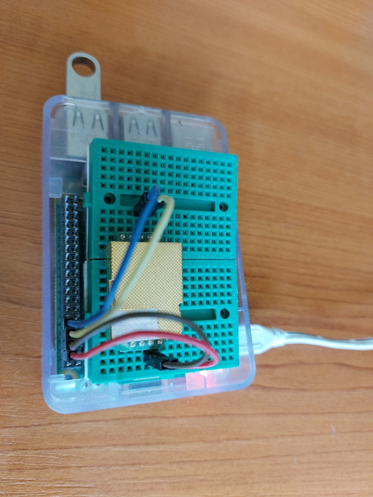

# About the MH-Z19 CO2 sensor

The MH-Z19 sensor is manufactured by Winsen Lt., China and the measurement method used is based on the non-dispersive infrared (NDIR) principle to detect the existence of CO2 in the air.
Key features according to the manufacturer are:

    good sensitivity.
    non-oxygen dependent.
    long life.
    built-in temperature compensation.
    UART serial interface and Pulse Width Modulation (PWM) output.

A nondispersive infrared sensor (or NDIR sensor) is a relatively simple spectroscopic sensor often used as a gas detector. It is nondispersive in the sense of optical dispersion since the infrared energy is allowed to pass through the atmospheric sampling chamber without deformation.
Principle of operation:
The main components of an NDIR sensor are an infrared source (lamp), a sample chamber or light tube, a light filter and an infrared detector. The IR light is directed through the sample chamber towards the detector. In parallel there is another chamber with an enclosed reference gas, typically nitrogen. The gas in the sample chamber causes absorption of specific wavelengths according to the Beer–Lambert law, and the attenuation of these wavelengths is measured by the detector to determine the gas concentration. The detector has an optical filter in front of it that eliminates all light except the wavelength that the selected gas molecules can absorb.

# Technical Parameters and Structure

https://www.winsen-sensor.com/d/files/infrared-gas-sensor/mh-z19b-co2-ver1_0.pdf

# 

pi@raspberrypi pinout
# Installation

### python 2.x
sudo pip install mh_z19
### python 3.x
sudo pip3 install mh_z19

### read CO2 Sensor value
pi@raspberrypi:~ $ sudo python3 -m mh_z19 